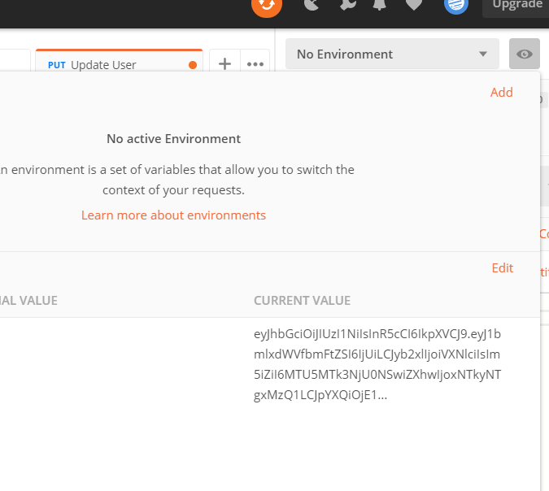

# Balance Management

## Structure

```
fullstack-owner-property-management
├── BalanceManagement.Api --> Web Api.
├── BalanceManagement.Contracts --> Contracts of The WebApi
├── BalanceManagement.Data --> Persistence Layers
├── BalanceManagement.Service --> Logic and access to data
└── BalanceManagement.Test --> Test
```
## Getting started.
1. Sql Server. Create the database: BalanceManagement. The connectionstring is configured for a instance of local Sql Server:"" and with windows Authentication
```
"Server=.\\;Database=BalanceManagement;Trusted_Connection=True;"
```
These settings must be changed in the file: appsettings.json for the application to work and in the DesignTimeDbContextFactory  class for migrations to work too.

2. Migrations. Set the project BalanceManagement.Data and run the command Updata-Database from Package Manager Console.
4. Set the project OwnerPropertyManagement.Api and run the project.
5.Folder: Postman. Create a user. This end point is public. Roles
  Admin=1
  User=2
  
 5.2. Login with the new user.
 
 

## How it work
Asp.Net core:
- JWT authentication using ASP.NET Core JWT Bearer Authentication.
- SeriLog.
- Automapper.
- Entity Framework Core.
- Xunit
- FluentValidation. Api contract validation
- Sqlite.To test EF core.
- Swagger. End points: https://localhost:44311/swagger/index.html
